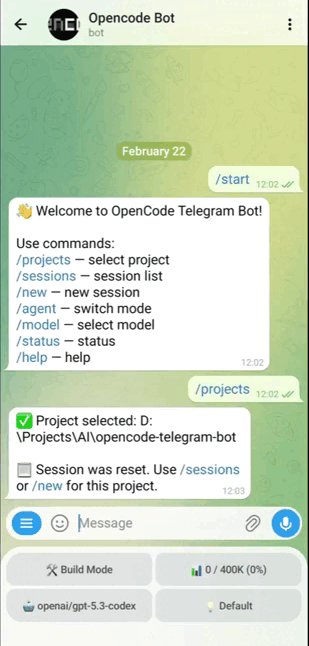

# OpenCode Telegram Bot

[](https://github.com/LevRa7/Opencode-tg-bot/actions/workflows/ci.yml)
[](LICENSE)
[](https://nodejs.org)

OpenCode Telegram Bot is a secure Telegram client for [OpenCode](https://opencode.ai) CLI that runs on your local machine.

Run AI coding tasks, monitor progress, switch models, and manage sessions from your phone.

No open ports, no exposed APIs. The bot communicates with your local OpenCode server and the Telegram Bot API only.

Scheduled tasks support. Turns the bot into a lightweight OpenClaw alternative for OpenCode users.

Platforms: macOS, Windows, Linux

Languages: English (`en`), Deutsch (`de`), Español (`es`), Français (`fr`), Русский (`ru`), 简体中文 (`zh`)

<p align="center">
  
</p>

## Features

- **Remote coding** — send prompts to OpenCode from anywhere, receive complete results with code sent as files
- **Session management** — create new sessions or continue existing ones, just like in the TUI
- **Live status** — pinned status per private chat or forum topic with current project, model, context usage, and changed files list, updated in real time
- **Model switching** — pick models from OpenCode favorites and recent history directly in the chat (favorites are shown first)
- **Agent modes** — switch between Plan and Build modes on the fly
- **Subagent activity** — watch live subagent progress in chat, including the current task, agent, model, and active tool step
- **Topic-scoped attach/follow** — attach existing OpenCode sessions independently per private chat or forum topic so follow-up updates stay in the right conversation
- **Custom Commands** — run OpenCode custom commands (and built-ins like `init`/`review`) from an inline menu with confirmation
- **MCP visibility** — inspect configured MCP servers and their connection state with `/mcps`
- **Interactive Q&A** — answer agent questions and approve permissions via inline buttons
- **Thought translation** — model reasoning blocks are automatically translated into your selected language via a local [LibreTranslate](https://libretranslate.com) server. Translated headlines appear in chat (`💭`/`🧠`), and full reasoning text in Telegraph pages is replaced with the translated version in the background
- **Multi-user / Tenancy** — the bot supports multiple users via `TELEGRAM_ALLOWED_USER_IDS`. Each user gets their own isolated OpenCode runtime and settings
- **SSH remote connections** — connect to a remote server via SSH and run OpenCode inside a Docker container. All operations (prompts, sessions, provider management) transparently route through the SSH tunnel. Supports key-based and password authentication
- **Provider management** — add AI providers (OpenAI, Anthropic, Google, OpenRouter, etc.) via `/connect`. Supports API key and OAuth authentication. Provider configuration persists across bot and container restarts via Docker volumes
- **Server control** — `/opencode_stop` and `/opencode_start` work with SSH connections — stop/start the remote OpenCode server without affecting the host
- **Multi-threaded (Forum Topics)** — the bot works in both private chats and Telegram group/forum topics. Each topic can have its own session attachment, model, and settings, keeping conversations organized
- **Voice prompts** — send voice/audio messages, transcribe them via a Whisper-compatible API, and optionally enable spoken replies with `/tts`
- **Optional auto-restart** — monitor the local OpenCode server and restart it automatically after stop/crash when enabled in config
- **Telegram-safe formatting** — assistant replies are rendered with a local MarkdownV2 formatter for more stable Telegram output
- **File attachments** — send images, PDF documents, and any text-based files to OpenCode (code, logs, configs etc.)
- **Scheduled tasks** — schedule prompts to run later or on a recurring interval; see [Scheduled Tasks](#scheduled-tasks)
- **Context control** — compact context when it gets too large, right from the chat
- **Input flow control** — when an interactive flow is active, the bot accepts only relevant input to keep context consistent and avoid accidental actions
- **Security** — strict user ID whitelist; no one else can access your bot, even if they find it
- **Localization** — UI localization is supported for multiple languages (`BOT_LOCALE`)

Planned features currently in development are listed in [Current Task List](PRODUCT.md#current-task-list).

## Prerequisites

- **Node.js 20+** — [download](https://nodejs.org)
- **OpenCode** — install from [opencode.ai](https://opencode.ai) or [GitHub](https://github.com/sst/opencode)
- **Telegram Bot** — you'll create one during setup (takes 1 minute)

## Quick Start

### 1. Create a Telegram Bot

1. Open [@BotFather](https://t.me/BotFather) in Telegram and send `/newbot`
2. Follow the prompts to choose a name and username
3. Copy the **bot token** you receive (e.g. `123456:ABC-DEF1234...`)

You'll also need your **Telegram User ID** — send any message to [@userinfobot](https://t.me/userinfobot) and it will reply with your numeric ID.

### 2. Start OpenCode Server

Start the OpenCode server:

```bash
opencode serve
```

> The bot connects to the OpenCode API at `http://localhost:4096` by default.

### 3. Install & Run

The fastest way — run directly with `npx`:

```bash
npx @levra7/opencode-telegram-bot
```

On first launch, an interactive wizard will guide you through the configuration — it asks for interface language first, then your bot token, user ID, OpenCode API URL, and optional OpenCode server credentials (username/password). After that, you're ready to go. Open your bot in Telegram and start sending tasks.

#### Alternative: Global Install

```bash
npm install -g @levra7/opencode-telegram-bot
opencode-telegram start
```

To reconfigure at any time:

```bash
opencode-telegram config
```

## Supported Platforms

| Platform | Status                                       |
| -------- | -------------------------------------------- |
| macOS    | Fully supported                              |
| Windows  | Fully supported                              |
| Linux    | Fully supported (tested on Ubuntu 24.04 LTS) |

## Bot Commands

| Command           | Description                                                  |
| ----------------- | ------------------------------------------------------------ |
| `/status`         | Server health, current project, session, and model info      |
| `/new`            | Create a new session                                         |
| `/abort`          | Abort the current task                                       |
| `/detach`         | Detach the current session from this chat/topic              |
| `/sessions`       | Browse and switch between recent sessions                    |
| `/model`          | Switch the active model from favorites/recent                |
| `/variant`        | Switch model variant (fast, default, thinking, etc.)         |
| `/compact`        | Compact (summarize) the current session context              |
| `/settings`       | Open user settings (language, toggles, timeouts)             |
| `/stream`         | Toggle streaming assistant responses on/off                  |
| `/restart`        | Restart the OpenCode server (admin only)                     |
| `/tts`            | Toggle audio replies                                         |
| `/projects`       | Switch between OpenCode projects                             |
| `/rename`         | Rename the current session                                   |
| `/commands`       | Browse and run custom commands                               |
| `/mcps`           | Browse available MCP servers and connection state            |
| `/task`           | Create a scheduled task                                      |
| `/tasklist`       | Browse and delete scheduled tasks                            |
| `/opencode_start` | Start the OpenCode server remotely                           |
| `/opencode_stop`  | Stop the OpenCode server remotely                            |
| `/open`           | Open files in directory browser                              |
| `/ls`             | Browse directory contents in a paginated menu                |
| `/skills`         | List available skills                                        |
| `/worktree`       | Manage worktrees                                             |
| `/help`           | Show available commands                                      |

Any regular text message is sent as a prompt to the coding agent only when no blocking interaction is active. Voice/audio messages are transcribed and then sent as prompts when STT is configured. When a chat or forum topic is attached to a session, follow-up updates and external-input notices stay scoped to that same conversation target.

> `/opencode_start` and `/opencode_stop` are intended as emergency commands — for example, if you need to restart a stuck server while away from your computer. Under normal usage, start `opencode serve` yourself before launching the bot.

## Scheduled Tasks

Scheduled tasks let you prepare prompts in advance and run them automatically later or on a recurring schedule. This is useful for periodic checks, routine code maintenance, or tasks you want OpenCode to execute while you are away from your computer. Use `/task` to create a scheduled task and `/tasklist` to review or delete existing ones.

- Each task is created from the currently selected OpenCode project and model
- Scheduled executions currently always run with the `build` agent
- Tasks run outside your active chat session, so they do not interrupt or affect the current session flow
- The minimum recurring interval is 5 minutes
- Up to 10 scheduled tasks can exist at once by default; change this with `TASK_LIMIT` in your `.env`

## Configuration

### Localization

- Supported locales: `en`, `de`, `es`, `fr`, `ru`, `zh`
- The setup wizard asks for language first
- You can change locale later with `BOT_LOCALE`

### Environment Variables

When installed via npm (`@levra7/opencode-telegram-bot`), the configuration wizard handles the initial setup. The `.env` file is stored in your platform's app data directory:

- **macOS:** `~/Library/Application Support/opencode-telegram-bot/.env`
- **Windows:** `%APPDATA%\opencode-telegram-bot\.env`
- **Linux:** `~/.config/opencode-telegram-bot/.env`

| Variable                        | Description                                                                                                  | Required | Default                  |
| ------------------------------- | ------------------------------------------------------------------------------------------------------------ | :------: | ------------------------ |
| `TELEGRAM_BOT_TOKEN`            | Bot token from @BotFather                                                                                    |   Yes    | —                        |
| `TELEGRAM_ADMIN_USER_ID`        | Admin Telegram user ID used for setup and privileged commands                                                |   Yes    | —                        |
| `TELEGRAM_ALLOWED_USER_IDS`     | Additional allowed Telegram user IDs (comma- or space-separated)                                             |    No    | —                        |
| `TELEGRAM_PROXY_URL`            | Proxy URL for Telegram API (SOCKS5/HTTP)                                                                     |    No    | —                        |
| `OPENCODE_API_URL`              | OpenCode server URL                                                                                          |    No    | `http://localhost:4096`  |
| `OPENCODE_SERVER_USERNAME`      | Server auth username                                                                                         |    No    | `opencode`               |
| `OPENCODE_SERVER_PASSWORD`      | Server auth password                                                                                         |    No    | —                        |
| `OPENCODE_AUTO_RESTART_ENABLED` | Monitor the local OpenCode server and restart it automatically after stop/crash                              |    No    | `false`                  |
| `OPENCODE_MONITOR_INTERVAL_SEC` | Health-check interval for OpenCode auto-restart monitoring (seconds)                                         |    No    | `300`                    |
| `OPENCODE_MODEL_PROVIDER`       | Default model provider                                                                                       |   Yes    | `cliproxyapi`            |
| `OPENCODE_MODEL_ID`             | Default model ID                                                                                             |   Yes    | `gpt-5.4-mini`           |
| `OPEN_BROWSER_ROOTS`            | Directory browser roots (comma-separated paths)                                                              |    No    | —                        |
| `BOT_LOCALE`                    | Bot UI language (supported locale code, e.g. `en`, `de`, `es`, `fr`, `ru`, `zh`)                             |    No    | `en`                     |
| `BASH_TOOL_DISPLAY_MAX_LENGTH`  | Maximum length of bash tool output to display in chat                                                        |    No    | `128`                    |
| `SESSIONS_LIST_LIMIT`           | Sessions per page in `/sessions`                                                                             |    No    | `10`                     |
| `PROJECTS_LIST_LIMIT`           | Projects per page in `/projects`                                                                             |    No    | `10`                     |
| `COMMANDS_LIST_LIMIT`           | Commands per page in `/commands`                                                                             |    No    | `10`                     |
| `TASK_LIMIT`                    | Maximum number of scheduled tasks that can exist at once                                                     |    No    | `10`                     |
| `SERVICE_MESSAGES_INTERVAL_SEC` | Service messages interval (thinking + tool calls); keep `>=2` to avoid Telegram rate limits, `0` = immediate |    No    | `5`                      |
| `SCHEDULED_TASK_EXECUTION_TIMEOUT_MINUTES` | Maximum execution time for a scheduled task in minutes                                                        |    No    | `120`                    |
| `HIDE_THINKING_MESSAGES`        | Hide `💭 Thinking...` service messages                                                                       |    No    | `false`                  |
| `HIDE_TOOL_CALL_MESSAGES`       | Hide tool-call service messages (`💻 bash ...`, `📖 read ...`, etc.)                                         |    No    | `false`                  |
| `HIDE_TOOL_FILE_MESSAGES`       | Hide tool file edit documents sent as .txt attachments                                                       |    No    | `false`                  |
| `RESPONSE_STREAMING`            | Stream assistant replies while they are generated across one or more Telegram messages                       |    No    | `true`                   |
| `RESPONSE_STREAM_THROTTLE_MS`   | Throttle interval between streaming messages (milliseconds)                                                  |    No    | `500`                    |
| `MESSAGE_FORMAT_MODE`           | Assistant reply formatting mode: `markdown` (Telegram MarkdownV2) or `raw`                                   |    No    | `markdown`               |
| `TELEGRAPH_ENABLED`             | Publish verbose technical progress details to Telegraph and link them from concise Telegram messages          |    No    | `false`                  |
| `TELEGRAPH_ACCESS_TOKEN`        | Telegraph API access token used when Telegraph detail publishing is enabled                                   |    No    | —                        |
| `TELEGRAPH_AUTHOR_NAME`         | Author name shown on generated Telegraph detail pages                                                         |    No    | `opencode-tg`            |
| `TELEGRAPH_TIMEOUT_MS`          | Telegraph publish request timeout in milliseconds                                                            |    No    | `3000`                   |
| `TELEGRAPH_MAX_CHARS`           | Maximum technical detail body length sent to Telegraph                                                       |    No    | `60000`                  |
| `TELEGRAPH_TRANSLATE_ENABLED`   | Automatically translate model thoughts to the user's language via LibreTranslate                             |    No    | `false`                  |
| `TELEGRAPH_TRANSLATE_API_URL`   | LibreTranslate server URL (e.g. `http://localhost:5000`)                                                     |    No    | —                        |
| `CODE_FILE_MAX_SIZE_KB`         | Max file size (KB) to send as document                                                                       |    No    | `100`                    |
| `STT_API_URL`                   | Whisper-compatible API base URL (enables voice/audio transcription)                                          |    No    | —                        |
| `STT_API_KEY`                   | API key for your STT provider                                                                                |    No    | —                        |
| `STT_MODEL`                     | STT model name passed to `/audio/transcriptions`                                                             |    No    | `whisper-large-v3-turbo` |
| `STT_LANGUAGE`                  | Optional language hint (empty = provider auto-detect)                                                        |    No    | —                        |
| `STT_NOTE_PROMPT`               | Note prompt for transcribed text                                                                             |    No    | —                        |
| `TTS_PROVIDER`                  | TTS provider: `openai` or `google`                                                                           |    No    | `openai`                 |
| `TTS_API_URL`                   | TTS API base URL for OpenAI-compatible providers                                                             |    No    | —                        |
| `TTS_API_KEY`                   | TTS API key for OpenAI-compatible providers                                                                  |    No    | —                        |
| `TTS_MODEL`                     | TTS model name passed to `/audio/speech` for OpenAI-compatible providers                                     |    No    | `gpt-4o-mini-tts`        |
| `TTS_VOICE`                     | TTS voice name; defaults to `alloy` for OpenAI and `en-US-Standard-A` for Google                            |    No    | provider-specific        |
| `GOOGLE_APPLICATION_CREDENTIALS` | Absolute path to a Google service account JSON file for Google Cloud TTS                                    |    No    | —                        |
| `LOG_LEVEL`                     | Log level (`debug`, `info`, `warn`, `error`)                                                                 |    No    | `info`                   |
| `LOG_RETENTION`                 | Number of log files to keep                                                                                  |    No    | `10`                     |

> **Keep your `.env` file private.** It contains your bot token. Never commit it to version control.

Telegraph detail publishing is optional. When enabled, concise localized tool, todo, and reasoning progress lines stay in Telegram, while longer technical details are published to Telegraph and linked from the progress line.

### Thought Translation (Optional)

When `TELEGRAPH_TRANSLATE_ENABLED=true` and a LibreTranslate server is running at `TELEGRAPH_TRANSLATE_API_URL`, the bot will automatically translate model reasoning blocks:

- **Chat headlines** — `💭` and `🧠` titles are translated into the bot's selected language
- **Telegraph pages** — full reasoning text is translated in the background and replaces the original content on the page

Install LibreTranslate locally (requires Python 3):

```bash
pipx install libretranslate
libretranslate --host 0.0.0.0 --port 5000 --load-only en,ru,de,fr,es,zh
```

Example systemd service (auto-start on boot):

```ini
[Unit]
Description=LibreTranslate
After=network.target

[Service]
Type=simple
User=your-username
ExecStart=/home/your-username/.local/bin/libretranslate --host 0.0.0.0 --port 5000 --load-only en,ru,de,fr,es,zh
Restart=always

[Install]
WantedBy=multi-user.target
```

### Voice and Audio Transcription (Optional)

If `STT_API_URL` and `STT_API_KEY` are set, the bot will:

1. Accept `voice` and `audio` Telegram messages
2. Transcribe them via `POST {STT_API_URL}/audio/transcriptions`
3. Show recognized text in chat
4. Send the recognized text to OpenCode as a normal prompt

If TTS is configured, you can toggle spoken replies globally with `/tts`. The preference is stored in `settings.json` and persists across restarts.

OpenAI-compatible TTS example:

```env
TTS_PROVIDER=openai
TTS_API_URL=https://api.openai.com/v1
TTS_API_KEY=your-tts-api-key
TTS_MODEL=gpt-4o-mini-tts
TTS_VOICE=alloy
```

Google Cloud TTS example:

```env
TTS_PROVIDER=google
GOOGLE_APPLICATION_CREDENTIALS=/absolute/path/to/google-service-account.json
# Optional override; defaults to en-US-Standard-A for Google
# TTS_VOICE=en-US-Standard-A
```

The bot strips Markdown before generating speech so links, headings, and formatting markers do not get read out literally.

Supported provider examples (Whisper-compatible):

- **OpenAI**
  - `STT_API_URL=https://api.openai.com/v1`
  - `STT_MODEL=whisper-1`
- **Groq**
  - `STT_API_URL=https://api.groq.com/openai/v1`
  - `STT_MODEL=whisper-large-v3-turbo`
- **Together**
  - `STT_API_URL=https://api.together.xyz/v1`
  - `STT_MODEL=openai/whisper-large-v3`

If STT variables are not set, voice/audio transcription is disabled and the bot will ask you to configure STT.

### Model Configuration

The model picker uses OpenCode local model state (`favorite` + `recent`):

- Favorites are shown first, then recent
- Models already in favorites are not duplicated in recent
- Current model is marked with `✅`
- Default model from `OPENCODE_MODEL_PROVIDER` + `OPENCODE_MODEL_ID` is always included in favorites

To add a model to favorites, open OpenCode TUI (`opencode`), go to model selection, and press **Cmd+F/Ctrl+F** on the model.

### Multi-User / Tenant Mode

The bot supports multiple users via `TELEGRAM_ALLOWED_USER_IDS`. Each user:

- Gets their own isolated OpenCode runtime (started on first message)
- Has independent session, model, and project state
- Has per-user settings (language, model preferences, etc.)

This is useful for teams sharing a single Telegram bot, or for running the bot under one account while granting access to another.

### Multi-Threaded (Forum Topics)

The bot works in both private chats and Telegram forum topics. Each topic:

- Has its own session attachment — different topics can work on different OpenCode sessions
- Remembers its model, variant, and agent independently
- Receives follow-up updates scoped to that topic only

To use: add the bot to a Telegram group with forum mode enabled. Each topic in the forum behaves like a separate bot conversation.

## Security

The bot enforces a strict **user ID whitelist**. The admin user from `TELEGRAM_ADMIN_USER_ID` is always allowed, and you can optionally grant access to additional users with `TELEGRAM_ALLOWED_USER_IDS`. Messages from any other user are silently ignored and logged as unauthorized access attempts.

Since the bot runs locally on your machine and connects to your local OpenCode server, there is no external attack surface beyond the Telegram Bot API itself.

## Development

### Running from Source

```bash
git clone https://github.com/LevRa7/Opencode-tg-bot.git
cd Opencode-tg-bot
npm install
cp .env.example .env
# Edit .env with your bot token, user ID, and model settings
```

Build and run:

```bash
npm run dev
```

### Available Scripts

| Script                          | Description                          |
| ------------------------------- | ------------------------------------ |
| `npm run dev`                   | Build and start (development)        |
| `npm run build`                 | Compile TypeScript                   |
| `npm start`                     | Run compiled code                    |
| `npm run release:notes:preview` | Preview auto-generated release notes |
| `npm run lint`                  | ESLint check (zero warnings policy)  |
| `npm run format`                | Format code with Prettier            |
| `npm test`                      | Run tests (Vitest)                   |
| `npm run test:coverage`         | Tests with coverage report           |

> **Note:** `npm run dev` still does not use a file watcher. For local source changes, rebuild/restart manually. Runtime auto-restart is an optional production safeguard for the managed OpenCode server process, not a development hot-reload feature.

## Troubleshooting

**Bot doesn't respond to messages**

- Make sure `TELEGRAM_ALLOWED_USER_ID` matches your actual Telegram user ID (check with [@userinfobot](https://t.me/userinfobot))
- Verify the bot token is correct

**"OpenCode server is not available"**

- Ensure `opencode serve` is running in your project directory
- Check that `OPENCODE_API_URL` points to the correct address (default: `http://localhost:4096`)

**No models in model picker**

- Add models to your OpenCode favorites: open OpenCode TUI, go to model selection, press **Ctrl+F** on desired models
- Verify `OPENCODE_MODEL_PROVIDER` and `OPENCODE_MODEL_ID` point to an available model in your setup

**Linux: permission denied errors**

- Make sure the CLI binary has execute permission: `chmod +x $(which opencode-telegram)`
- Check that the config directory is writable: `~/.config/opencode-telegram-bot/`

## Contributing

Please follow commit and release note conventions in [CONTRIBUTING.md](CONTRIBUTING.md).

## Community

Have questions, want to share your experience using the bot, or have an idea for a feature? Join the conversation in [GitHub Discussions](https://github.com/LevRa7/Opencode-tg-bot/discussions).

## License

[MIT](LICENSE) © Ruslan Grinev
